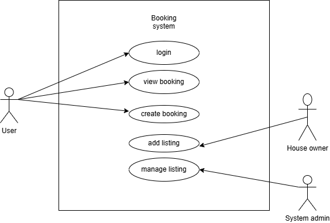

# Requirement Analysis in Software Development

## Introduction

This repository contains the foundational documentation and visual modeling for a Booking Management System as part of a structured software development lifecycle (SDLC). It focuses on Requirement Analysis, which is essential for translating project goals into actionable development tasks through clear, structured, and validated specifications.

---

## What is Requirement Analysis?

Requirement Analysis is a systematic process in software engineering for understanding, documenting, and managing the needs and expectations of stakeholders for a new or modified product. It is one of the earliest phases in the SDLC and lays the groundwork for project success.

It involves eliciting needs from stakeholders, defining functional and non-functional requirements, and documenting them in a clear and organized format. Proper requirement analysis helps avoid ambiguity, reduces development costs, and ensures the final product aligns with business objectives and user needs.

---

## Why is Requirement Analysis Important?

1. **Improves Communication**

   - Bridges the gap between stakeholders, users, and developers by providing a shared understanding of what needs to be built.

2. **Reduces Risks**

   - Early identification of potential issues reduces the risk of project failure or costly rework during later stages of development.

3. **Ensures Project Alignment**
   - Keeps the project on track by ensuring all features and functions directly align with business goals and user expectations.

---

## Key Activities in Requirement Analysis

- **Requirement Gathering**

  - Collecting information from stakeholders through interviews, surveys, and observations.

- **Requirement Elicitation**

  - Digging deeper into gathered data to extract detailed, actionable requirements.

- **Requirement Documentation**

  - Structuring requirements in formats like user stories, SRS documents, or use case diagrams.

- **Requirement Analysis and Modeling**

  - Evaluating requirements for clarity, completeness, and feasibility; modeling interactions using diagrams.

- **Requirement Validation**
  - Verifying that documented requirements match stakeholder expectations and are achievable within constraints.

---

## Types of Requirements

### Functional Requirements

These describe what the system should do.

**Examples for Booking System:**

- Users must be able to register and log in.
- Admins can approve or reject booking requests.
- Users can browse available services and make a booking.

### Non-functional Requirements

These define how the system should behave.

**Examples for Booking System:**

- The system should respond to booking requests within 2 seconds.
- Data should be encrypted in transit and at rest.
- The application must be available 99.9% of the time.

---

## Use Case Diagrams

Use Case Diagrams visually represent system functionality by showing how different users (actors) interact with the system.

### Benefits:

- Clarify system functionality and boundaries.
- Identify the roles and responsibilities of each actor.
- Help developers understand interaction flows before implementation.

### Booking Management System Use Case Diagram

_Note: Diagram created using [Draw.io](https://draw.io) and exported as `alx-booking-uc.png`._

Actors:

- User
- Admin
- System

Use Cases:

- Register/Login
- Browse Services
- Make Booking
- View Bookings
- Approve/Reject Booking (Admin)
- Send Notifications

---

## Acceptance Criteria

Acceptance Criteria are the conditions that a software product must satisfy to be accepted by a user or customer.

### Why it's important:

- Provides a clear definition of done.
- Sets expectations between stakeholders and developers.
- Enables precise testing and validation.

### Example: Checkout Feature

**User Story**: As a user, I want to finalize my booking and make payment via mobile money.

**Acceptance Criteria:**

- User must be able to select a payment method.
- Payment gateway should respond within 5 seconds.
- Booking status changes to “Confirmed” after successful payment.
- An email and SMS confirmation is sent immediately.

---
